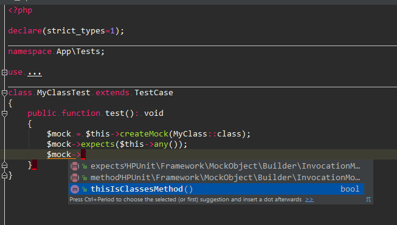

# PHPUnit PhpStorm meta file

This package fixes code completion for PhpUnit. Currently it only supports `createMock` and `getMockForAbstractClass` method for both namespaced and legacy versions of `TestCase`. 



## Instalation

```bash
composer require --dev tomasfejfar/phpunit-phpstorm-meta 
```
